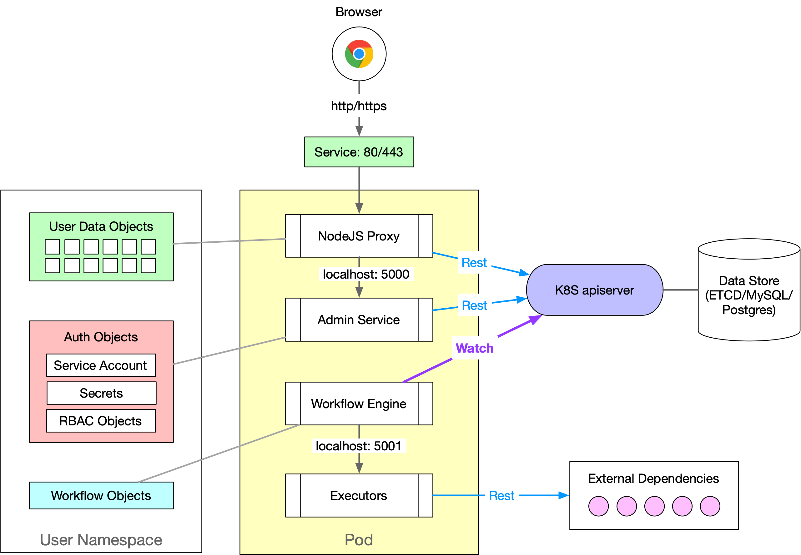

   
  <h1 align="center"><a href="https://flintdev.github.io/docs">Flint</a></h1>

## Introduction

Flint is a low-code development platform based on kubernetes architecture and corresponding ecosystem in open-source community. 
It provides developers complete solution to build modern web applications for their complex business requirements in a visualized way with minimum coding efforts.

Advantages comparing with other commercial low-code solutions:

* **Single Page Application (SPA).** The applications built in Flint are react-based single page applications with dynamic UI and efficient rendering performance. 
Flint provides a serial of innovative functions in product to enable developers to build UI and frontend logic in a fast and comfortable way.
* **State-based UI construction.** The UI construction method is state based supported by the complete state management mechanism provided by React & Redux. 
Developers only need to design and update the state model to implement dynamic UI interactions.
* **DAG based workflow engine.** Any complex business logic could be defined in the DAG workflow engine with manual and parallel steps.
* **Model-driven design pattern for both frontend and backend.** Each component in frontend UI is bind to global state defined by developers and each UI action is to update the state. 
The workflows in backend are always triggered by the update events of data models.
* **Source code generation.** After the application is constructed, Flint will automatically generate the structured source code. Users can use the source code for secondary development, or 
integrated with existing repo.
* **Plugin Framework.** The UI components are installed as plugins of Flint. Users can choose the component libraries and install them on demand. Third-party developers can also develop and publish their components as plugins in Flint.
* **Cloud native deployment solution.** Based on the Kubernetes ecosystem in open-source community, Flint provides complete solution to test and deployment applications to public or private cloud. 

> Please note: current stage of Flint is still alpha and we are in rapid iterations to deliver features in the roadmap. The beta version is planned to be released by the end of this year. It is not recommended to use Flint in production before beta.

## Application Architecture

